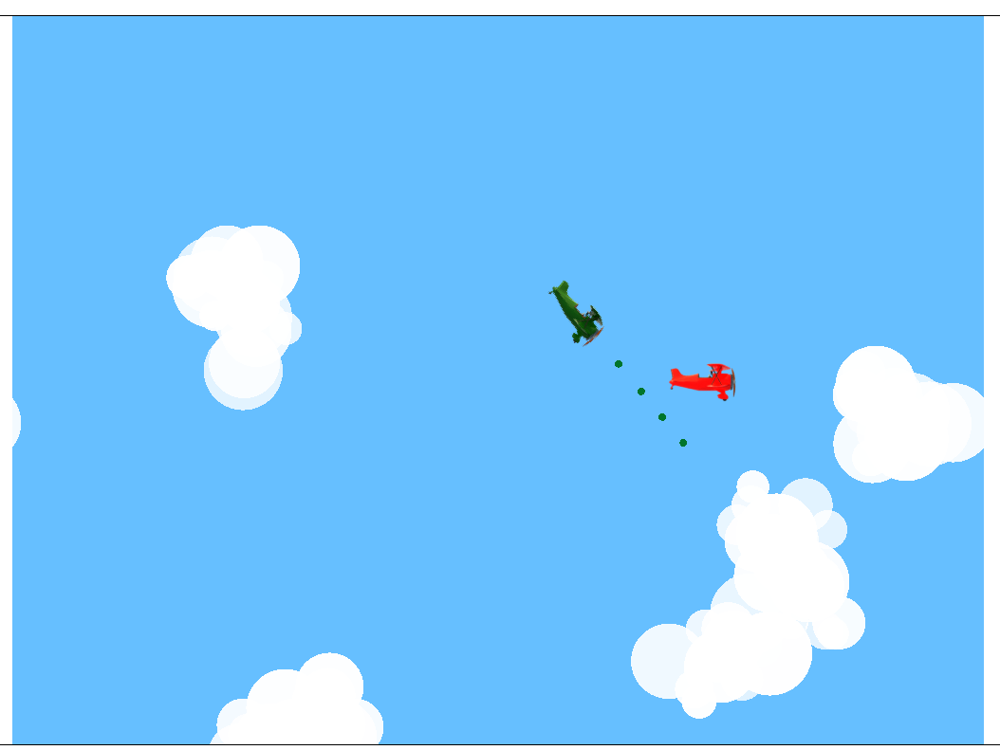

Planes
======

This is a simple 2D game created with raylib and implemented in C++. The game
compiles to WebAssembly and can be run in a web browser.

The code is very much work in progress. This is just me getting familiar with
raylib.

